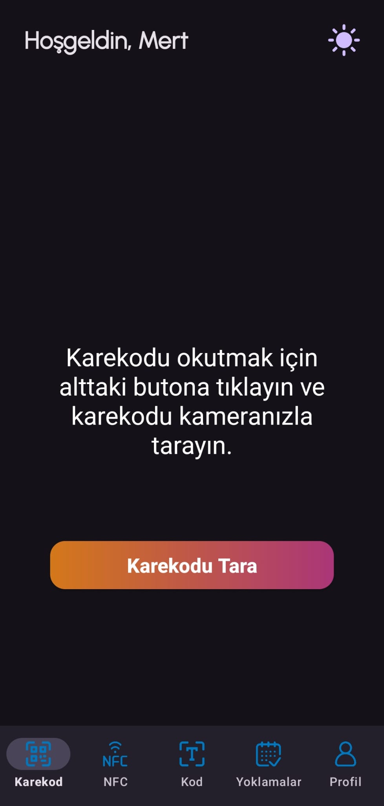
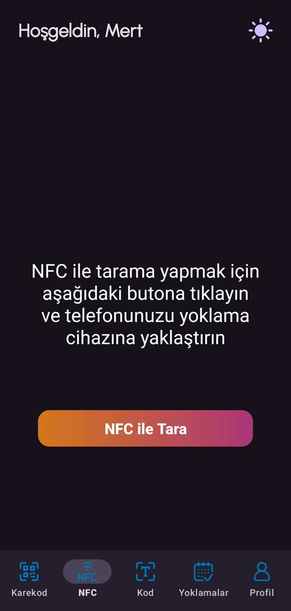
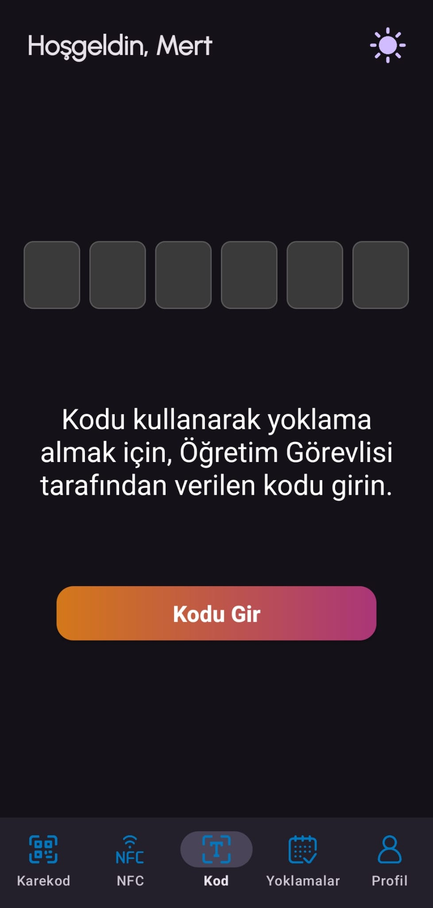
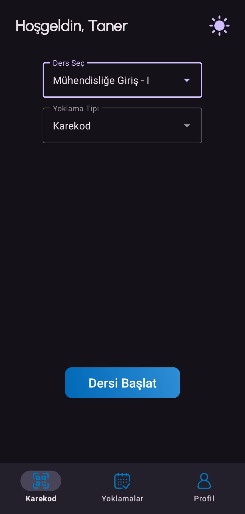
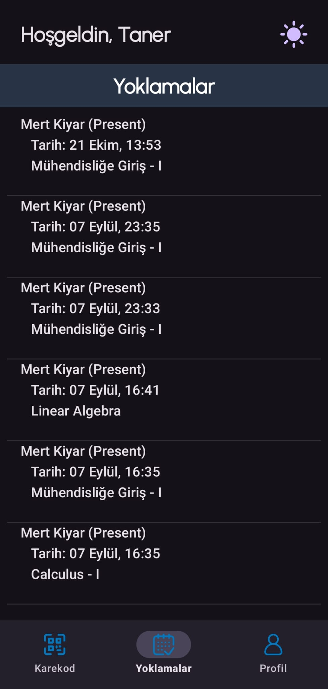

# ClassQRoom (CQR)

*An experimental and evolving approach to classroom attendance. This project is a personal journey of combining different ideas and technologies to build an alternative solution. It's not perfect and is constantly being improved, serving primarily as a learning experience and a playground for new concepts.*

## Inspiration

ClassQRoom was born out of a simple question: "If I were to build my university's attendance application, how would I make it better?" This project is an effort to create a more intuitive, modern, and secure attendance system.

Instead of collecting attendance with signatures on paper, ClassQRoom provides a faster and more efficient way for students to attend, while giving lecturers better data and control.

## Key Features (Current & Upcoming)

### Multiple Secure Entry Methods

- QR code scanning
- NFC tap-to-attend
- 6-digit code entry
- Simultaneous support for all methods on a single screen

  
  
  

### Advanced Security Constraints (In Progress)

- Dynamic QR codes (time-based and scan-limit rotation)
- Device-based restrictions (1 student per device)
- Location protection via GPS
- Network constraints (Campus Wi-Fi only)
  
### Instructor Dashboard

- Detailed student analytics (Just-in-time vs Latecomers)
- Flexible attendance management and session resets
- Direct notifications to students
- "Exempt" status controls

  
  

## Architecture & Technologies

- **Client:** Native Android (Java)
- **Backend Architecture:** Spring Boot REST API
- **Database:** PostgreSQL

*Note: The project was initially prototyped with a local database and Firebase, but has since been migrated to a fully custom, scalable backend architecture.*

## Planned Improvements

- Complete UI/UX overhaul to utilize the new expansive database structure
- Completing the remaining core functionalities and refining session-handling edge cases
